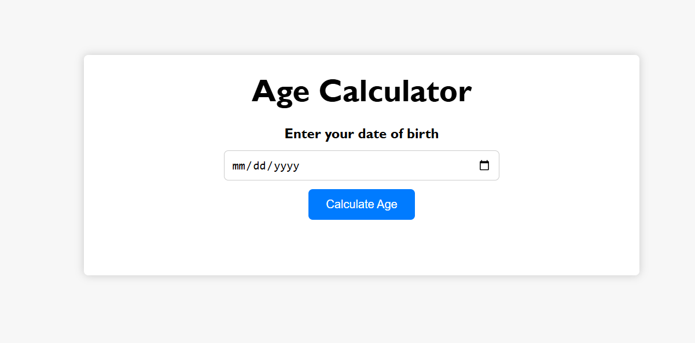
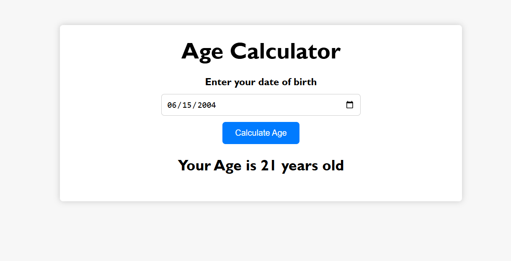

# Age Calculator

A simple and interactive **Age Calculator** web application built with HTML, CSS, and JavaScript. Calculate your age instantly by entering your date of birth.

---

## Demo

Here’s how the Age Calculator looks:




---

## Features

- Select your date of birth using a date picker.
- Click a button to calculate your age instantly.
- Displays age in years with proper singular/plural grammar.
- Responsive design suitable for desktop and mobile devices.

---

## Technologies Used

- HTML5
- CSS3
- JavaScript (ES6)

---

## How It Works

1. User selects their date of birth from the input field.
2. JavaScript calculates the age based on the current date.
3. The result is dynamically displayed below the button.

---

## Installation
1. Clone the repository:
```bash
git clone https://github.com/RituPagar12/age-calculator.git
```
2. Navigate to the project folder:
```bash
cd age-calculator
```
3. Open index.html in your browser.
